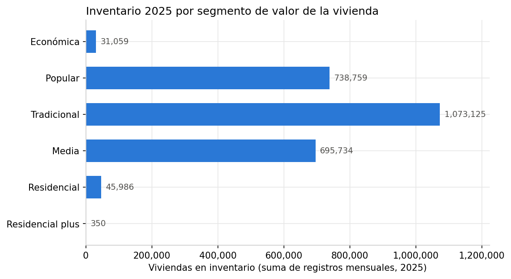
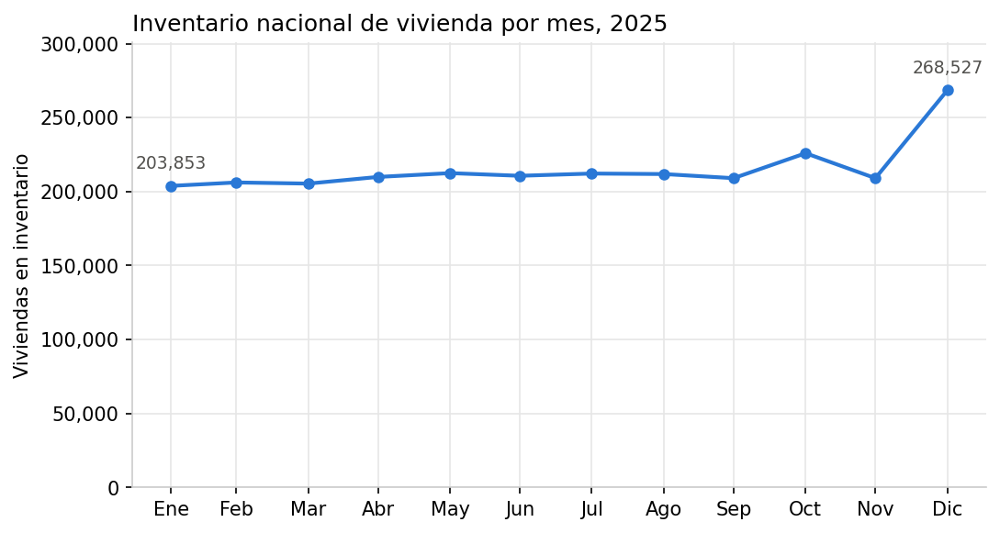
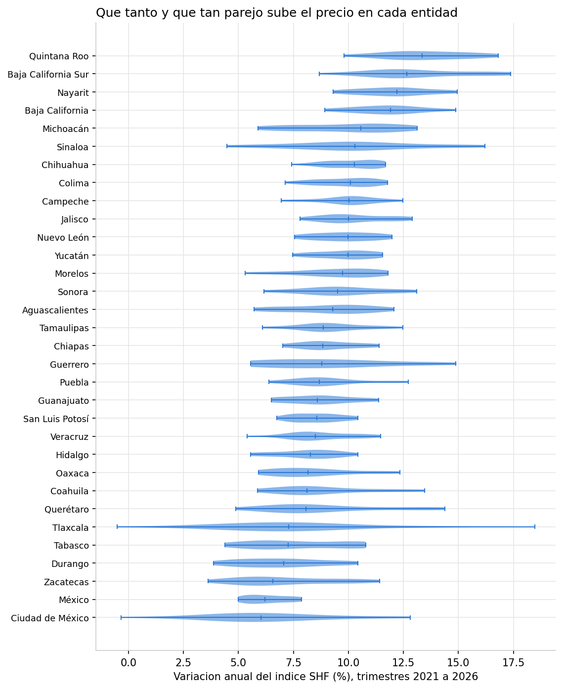
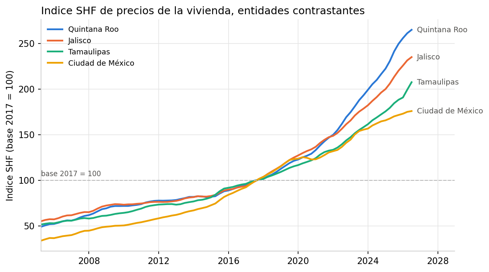

# Bitácora 03. Exploración inicial (EDA)

Estas cuatro figuras son el primer vistazo a los datos, no resultados. Su
función es que el equipo conozca la forma de lo que tiene entre manos y salga
con preguntas concretas. Las genera `Proyecto/Herramientas/eda_inicial.py`
(requiere haber corrido antes los scripts de limpieza y del índice SHF):

    python3 Proyecto/Herramientas/eda_inicial.py

Las imágenes quedan en `Proyecto/Documentacion/figuras/`. Si cambian los datos
o quieren ajustar una figura, editen el script y vuelvan a correrlo; no
retoquen los PNG.

## Figura 1. Inventario por segmento de valor

Lectura. El inventario se concentra en los tres segmentos intermedios:
Tradicional (1,073,125 registros de vivienda acumulados en el año), Popular
(738,759) y Media (695,734). Los extremos son marginales: Económica suma
31,059 y Residencial plus apenas 350. Ojo con la unidad: es la suma de los
registros mensuales, así que una vivienda que pasa seis meses en inventario
cuenta seis veces.

Pregunta para el equipo: con 350 registros en todo el año, ¿tiene sentido
analizar Residencial plus por separado, o conviene agrupar segmentos? Y para
su pregunta de investigación, ¿les interesa el acervo promedio mensual o el
acumulado del año? La respuesta cambia la unidad de todas las tablas que
sigan.

## Figura 2. Evolución mensual del inventario en 2025

Lectura. El inventario nacional se mueve poco entre enero y septiembre (entre
204 y 212 mil viviendas), sube en octubre, regresa en noviembre y salta en
diciembre a 268,527, un aumento de 28 por ciento respecto a noviembre. Un
detalle que sirve de lección: septiembre y noviembre suman exactamente lo
mismo (209,053). Lo verificamos y los registros de ambos meses sí son
distintos, la coincidencia es solo en el total, pero ese es el tipo de cosa
que siempre se comprueba antes de asumir un error o un duplicado.

Pregunta para el equipo: ¿el salto de diciembre es un fenómeno real (registro
de proyectos al cierre del año) o un artefacto de cómo reporta el SNIIV?
Desagreguen ese mes por entidad y por avance de obra antes de usar 2025
completo en cualquier serie.

## Figura 3. Variación anual del índice SHF por entidad

Lectura. Cada violín es la distribución de las variaciones anuales
trimestrales de una entidad entre 2021 y 2026, ordenadas por mediana. Todas
las medianas son positivas: el precio nominal subió en todo el país. Arriba
quedan Quintana Roo, Baja California Sur y Nayarit, con medianas superiores al
12 por ciento anual; abajo, Ciudad de México y el Estado de México, alrededor
del 6 por ciento. La forma también informa: Tlaxcala tiene el violín más
ancho, con variaciones que van de terreno negativo hasta más de 18 por ciento,
señal de un mercado chico y volátil donde pocas transacciones mueven el
índice.

Pregunta para el equipo: estas variaciones son nominales. ¿Cuánto de ese 6 por
ciento de la Ciudad de México es solo inflación general? Decidan si su
análisis necesita deflactar el índice (por ejemplo con el INPC) y qué
entidades ameritan estudio a fondo.

## Figura 4. Series del índice SHF en entidades contrastantes

Lectura. Las cuatro entidades se eligieron por contraste. Quintana Roo pasó de
la parte baja de la distribución en 2005 a encabezar el índice en 2026 (265
puntos, es decir, 2.65 veces el nivel de 2017). La Ciudad de México muestra el
patrón inverso: fue la que más creció antes de 2017 y la más lenta después.
Jalisco acelera de forma sostenida desde 2016 y Tamaulipas da el estirón más
reciente. La divergencia fuerte entre entidades empieza alrededor de 2020.

Pregunta para el equipo: ¿qué explica el quiebre de 2020 a 2021 en adelante
(pandemia, trabajo remoto, turismo, nearshoring)? No lo respondan de memoria:
esa es exactamente la clase de hipótesis que su revisión de literatura debe
respaldar o descartar.

## Lo que sigue y les toca a ustedes

1. Formulen la pregunta de investigación con el precio como variable, a la luz
   de estas figuras. Por ejemplo, la relación entre la composición del
   inventario de una entidad y el ritmo al que sube su índice de precios es
   una veta posible, pero la decisión es de ustedes y debe quedar escrita.
2. El cruce fino inventario contra índice sigue pendiente. `cruzar_shf.py`
   imprime un cruce de prueba por entidad y trimestre; convertirlo en la tabla
   de análisis del proyecto (con qué agregación, qué periodo y qué se hace con
   los trimestres que la SHF aún no publica) es trabajo de ustedes y merece su
   propia bitácora.
3. La matriz de revisión en `Articulos/Revision/` sigue sin existir y es la
   fase actual del curso. Las hipótesis que les dejaron las figuras 3 y 4 son
   un buen filtro para decidir qué artículos entran.
4. Documenten cada figura o tabla nueva igual que aquí: el script que la
   genera, la lectura en dos o tres líneas y la pregunta que abre. Una figura
   que no pueden explicar en voz alta no va en el reporte.
